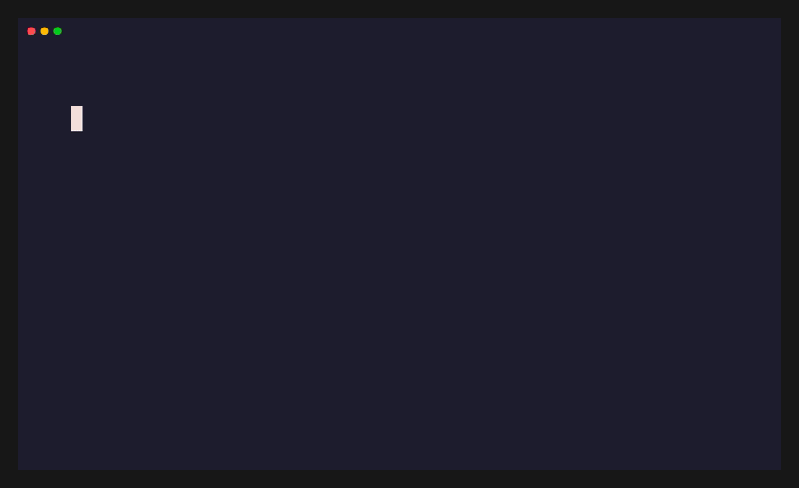

<h1>

SYED SHAFKAT RAIYAN

</h1>

 
<i>"Unfortunately, the clock is ticking, the hours are going by. The past increases, the future recedes. Possibilities decreasing, regrets mounting." — Haruki Murakami</i>

---

